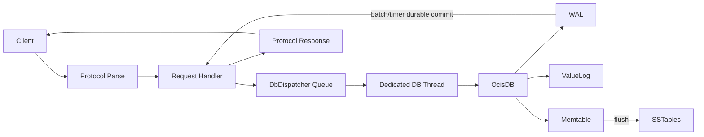

# Ocis

[中文](./REAMDE_zh.md) | **English**

[](https://github.com/muqiuhan/Ocis/actions/workflows/build-test.yaml)
[](https://github.com/muqiuhan/Ocis/actions/workflows/qodana_code_quality.yml)

Ocis is a key-value storage project implemented in F# with two runnable forms:

- **Ocis**: An embedded storage engine with WiscKey-style key/value separation
- **Ocis.Server**: A TCP server that exposes `SET/GET/DELETE` operations via a custom binary protocol

## Project Overview

### What Ocis Is
- Suitable for single-node deployments requiring a compact embedded engine and lightweight TCP server
- Includes durability modes (`Strict`, `Balanced`, `Fast`), WAL replay, SSTable compaction, and recovery tests

### What Ocis Is Not
- Not a distributed/replicated database (no Raft, no multi-node consistency, no built-in failover)

## Project Structure

```
Ocis/
├── Ocis/                      # Core storage engine
│   ├── Ocis.fs               # Main engine implementation
│   └── Ocis.fsproj           # Project file
├── Ocis.Server/              # TCP server
│   ├── Program.fs            # CLI entry point
│   ├── Config.fs             # Configuration validation
│   ├── Host.fs               # Hosted service
│   ├── Server.fs             # TCP server
│   ├── DbDispatcher.fs       # Database dispatcher
│   └── Ocis.Server.fsproj    # Project file
├── Ocis.Tests/               # Engine tests
├── Ocis.Server.Tests/        # Server tests
├── Ocis.Perf/                # Performance testing tools
└── Ocis.Perf.Tests/          # Performance test validation
```

## Architecture and Technology Stack

### Technology Stack
- **Language/Runtime**: F# on .NET 10
- **Hosting Framework**: `Microsoft.Extensions.Hosting`
- **Logging**: `Microsoft.Extensions.Logging`
- **CLI Framework**: `FSharp.SystemCommandLine`

### Concurrency Model
- **Engine**: Strict single-thread affinity with fail-fast thread checks
- **Server**: Bounded queue + dedicated dispatcher thread with asynchronous request processing

### Storage Design
- **Key Metadata**: Stored in Memtable/SSTable
- **Value Data**: Stored in append-only ValueLog
- **Durability**: WAL (Write-Ahead Log) for durability and replay

## Request/Data Flow



## Durability Modes

- **Strict**: Each write waits for durable WAL flush before success
- **Balanced**: Group commit (time window + batch size trigger)
- **Fast**: No per-request durable wait (highest throughput, weakest durability)

## Implementation Notes

- Strict single-thread engine is enforced by thread affinity checks in core operations
- Server dispatcher binds the engine to a dedicated worker thread
- Balanced durability was optimized to avoid dispatcher head-of-line blocking by deferred commit waiting
- WAL checkpoint/reset is implemented and covered by tests

## Performance Results

Environment: Local developer machine, single-node, `value=256B`, short repeated runs from `Ocis.Perf` aggregate outputs in `BenchmarkDotNet.Artifacts/results/throughput/`.

### Engine (workers=1)

| Mode     | Workload | Throughput (ops/s) | p99 (ms) |
| -------- | -------- | -----------------: | -------: |
| Balanced | set      |             128.22 |     8.12 |
| Strict   | set      |             324.36 |     6.04 |
| Fast     | set      |          49,405.64 |   0.0089 |
| Balanced | get      |         997,083.92 |    0.002 |
| Balanced | mixed    |             428.73 |     8.09 |

### Server (workers=32, set)

| Mode     |     ops/s | p99 (ms) |
| -------- | --------: | -------: |
| Balanced |  3,109.27 |    19.79 |
| Strict   |    410.06 |    94.04 |
| Fast     | 35,196.24 |    21.07 |

**Notes:**
- The large Balanced improvement comes from deferred commit waiting + batch trigger path
- These are not cross-machine benchmark claims; treat them as current repository baseline snapshots

## Build, Run, Test

### Build

```bash
dotnet build Ocis.sln -c Release
```

### Run Server

`working-dir` is a required positional argument. **Note:** The directory must exist before running.

```bash
# Create the data directory first
mkdir -p ./data

# Run the server
dotnet run --project Ocis.Server/Ocis.Server.fsproj -- ./data \
  --host 0.0.0.0 \
  --port 7379 \
  --max-connections 1000 \
  --flush-threshold 1000 \
  --durability-mode Balanced \
  --group-commit-window-ms 5 \
  --group-commit-batch-size 64 \
  --db-queue-capacity 8192 \
  --checkpoint-min-interval-ms 30000 \
  --log-level Info
```

### Run Tests

```bash
# Engine + server tests
dotnet test Ocis.Tests/Ocis.Tests.fsproj --filter "TestCategory!=Slow"
dotnet test Ocis.Server.Tests/Ocis.Server.Tests.fsproj

# Performance harness tests
dotnet test Ocis.Perf.Tests/Ocis.Perf.Tests.fsproj
```

## Performance Testing and Deployment

### Throughput Benchmark Commands

```bash
# Engine matrix (strict single-thread baseline)
bash scripts/run-throughput-engine.sh

# Server matrix
bash scripts/run-throughput-server.sh 127.0.0.1 7379
```

See `docs/operations/performance-testing.md` for warmup/repeat/aggregation format and interpretation.

### Deployment Guidance

**Suitable for:**
- Single-node service deployment with explicit durability mode selection

**For production exposure:**
- Put TLS/auth in front (reverse proxy / gateway)
- Monitor request latency, error rate, dispatcher queue depth, and WAL growth
- Run crash-recovery and throughput checks before release

**Related documentation:**
- `docs/operations/production-runbook.md`
- `docs/operations/release-checklist.md`
- `docs/operations/rollback-playbook.md`

## License

See [LICENSE](./LICENSE).
