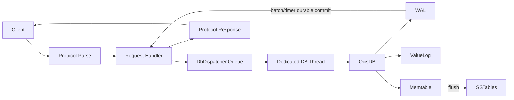

# Ocis

[中文](./REAMDE_zh.md) | **English**

[](https://github.com/muqiuhan/Ocis/actions/workflows/build-test.yaml) [](https://github.com/muqiuhan/Ocis/actions/workflows/nightly-full-tests.yaml) [](https://github.com/muqiuhan/Ocis/actions/workflows/nightly-release.yaml)

Ocis is a key-value storage engine implemented in F# on .NET 10. It provides two operational forms: an embedded storage engine (Ocis) and a TCP server. The embedded form allows developers to integrate the storage engine directly into application processes; the server form exposes SET/GET/DELETE operations via a custom binary protocol.

Ocis is designed for single-node scenarios. It does not provide distributed replication, Raft consensus, or failover mechanisms. If your architecture requires cross-node data consistency, consider alternative solutions.

## Architecture

Ocis adopts a WiscKey-style key-value separation design. WiscKey is a variant of LSM-Tree architecture, proposed by Lu et al. in the 2017 paper [WiscKey: Separating Keys from Values in SSD-conscious Storage](https://www.usenix.org/system/files/conference/fast16/fast16-papers-lu.pdf). Its core idea is separating keys from values: key metadata is stored in LSM-Tree, while values are stored in an append-only log (ValueLog). This design reduces both write amplification and space amplification.

Ocis follows this approach. Key metadata is stored in Memtable and SSTable, while value data is written to an append-only ValueLog. In large-value scenarios, traditional LSM-Tree requires repeated reads and writes of complete key-value pairs during compaction. With key-value separation, compaction only processes metadata, significantly reducing write amplification. WAL (Write-Ahead Log) ensures write durability and supports crash recovery through replay.



The engine core enforces a strict single-thread affinity model. All operations on Memtable, WAL, and ValueLog execute on the same thread; thread check failures immediately throw exceptions. This design eliminates internal lock contention and simplifies state management complexity. The TCP server layer receives requests through a bounded queue, with a dedicated dispatcher thread serializing execution, bridging concurrent requests to the single-threaded engine.

The technology stack uses `Microsoft.Extensions.Hosting` as the hosting framework, `Microsoft.Extensions.Logging` for logging output, and `FSharp.SystemCommandLine` for CLI interface construction.

## Durability Modes

Ocis provides three durability modes, representing different trade-offs between performance and durability.

Strict mode requires each write operation to wait for WAL durable flush completion before returning success. This guarantees the highest durability but each write blocks on disk I/O.

Fast mode does not wait for per-request durability confirmation. Write operations return immediately after submission, with durability handled asynchronously in the background. This provides the highest throughput but may lose the most recent batch of writes on crash.

Balanced mode adopts a group commit strategy. Requests enter a wait queue after arrival; when the queue reaches batch threshold or time window timeout, a single WAL flush is triggered and all waiters are batch-woken. The core advantage of group commit lies in merging multiple disk I/Os into one. This advantage only holds under concurrent scenarios: in single-threaded environments, each request waits alone for window timeout, making it slower than Strict mode. Test data shows that with 32 concurrent writes, Balanced mode throughput is 7.6x that of Strict, with p99 latency reduced by 79%.

| Mode     | Throughput Priority | Durability Priority | Use Case                |
|----------|---------------------|---------------------|-------------------------|
| Fast     | Highest             | Lowest              | Cache, rebuildable data |
| Strict   | Lowest              | Highest             | Financial, audit logs   |
| Balanced | Medium              | Medium              | Multi-threaded servers  |

Single-threaded embedded scenarios should choose Fast or Strict, not Balanced.

## Performance Data

The following data comes from throughput tests in a local development environment. Test conditions: value=256B, single-node, aggregated results in `BenchmarkDotNet.Artifacts/results/throughput/`. These data serve as in-repository performance baselines and do not constitute cross-hardware comparison benchmarks.

### Engine Throughput (Single-threaded)

| Mode     | SET ops/s | GET ops/s |
|----------|----------:|----------:|
| Fast     |  86,814   | -         |
| Strict   |   2,140   | -         |
| Balanced |     624   |  778,993  |

Balanced mode performs worse than Strict in single-threaded SET scenarios. The reason is that group commit's time window becomes an additional latency source without concurrency.

### Server Throughput (32 Concurrent, SET)

| Mode     | ops/s   | p99 (ms) |
|----------|--------:|---------:|
| Fast     | 35,196  | 21       |
| Balanced |  3,109  | 20       |
| Strict   |    410  | 94       |

In multi-threaded server scenarios, Balanced provides approximately 7.6x throughput improvement over Strict, with p99 latency reduced from 94ms to 20ms.

## Quick Start

```bash
dotnet build Ocis.sln -c Release
```

Create the data directory before running the server:

```bash
mkdir -p ./data
dotnet run --project Ocis.Server/Ocis.Server.fsproj -- ./data \
  --host 0.0.0.0 \
  --port 7379 \
  --durability-mode Balanced \
  --log-level Info
```

For complete parameter descriptions, see `Ocis.Server --help`.

Run tests:

```bash
dotnet test Ocis.Tests/Ocis.Tests.fsproj --filter "TestCategory!=Slow"
dotnet test Ocis.Server.Tests/Ocis.Server.Tests.fsproj
```

## Deployment

Complete the following preparations before production deployment:

- Configure TLS termination and authentication (recommended via reverse proxy or gateway)
- Establish monitoring to track request latency, error rate, dispatcher queue depth, and WAL growth
- Execute crash recovery tests and throughput verification

Related operations documentation: `docs/operations/production-runbook.md`, `docs/operations/release-checklist.md`, `docs/operations/rollback-playbook.md`.

## Project Structure

```
Ocis/
├── Ocis/                 # Core storage engine
├── Ocis.Server/          # TCP server
├── Ocis.Tests/           # Engine tests
├── Ocis.Server.Tests/    # Server tests
├── Ocis.Perf/            # Performance testing tools
└── Ocis.Perf.Tests/      # Performance test validation
```

## [LICENSE](./LICENSE)

```
Copyright (c) 2025 ~ 2026 Somhairle H. Marisol

All rights reserved.

Redistribution and use in source and binary forms, with or without modification,
are permitted provided that the following conditions are met:

    * Redistributions of source code must retain the above copyright notice,
      this list of conditions and the following disclaimer.
    * Redistributions in binary form must reproduce the above copyright notice,
      this list of conditions and the following disclaimer in the documentation
      and/or other materials provided with the distribution.
    * Neither the name of Ocis nor the names of its contributors
      may be used to endorse or promote products derived from this software
      without specific prior written permission.

THIS SOFTWARE IS PROVIDED BY THE COPYRIGHT HOLDERS AND CONTRIBUTORS
"AS IS" AND ANY EXPRESS OR IMPLIED WARRANTIES, INCLUDING, BUT NOT
LIMITED TO, THE IMPLIED WARRANTIES OF MERCHANTABILITY AND FITNESS FOR
A PARTICULAR PURPOSE ARE DISCLAIMED. IN NO EVENT SHALL THE COPYRIGHT OWNER OR
CONTRIBUTORS BE LIABLE FOR ANY DIRECT, INDIRECT, INCIDENTAL, SPECIAL,
EXEMPLARY, OR CONSEQUENTIAL DAMAGES (INCLUDING, BUT NOT LIMITED TO,
PROCUREMENT OF SUBSTITUTE GOODS OR SERVICES; LOSS OF USE, DATA, OR
PROFITS; OR BUSINESS INTERRUPTION) HOWEVER CAUSED AND ON ANY THEORY OF
LIABILITY, WHETHER IN CONTRACT, STRICT LIABILITY, OR TORT (INCLUDING
NEGLIGENCE OR OTHERWISE) ARISING IN ANY WAY OUT OF THE USE OF THIS
SOFTWARE, EVEN IF ADVISED OF THE POSSIBILITY OF SUCH DAMAGE.
```