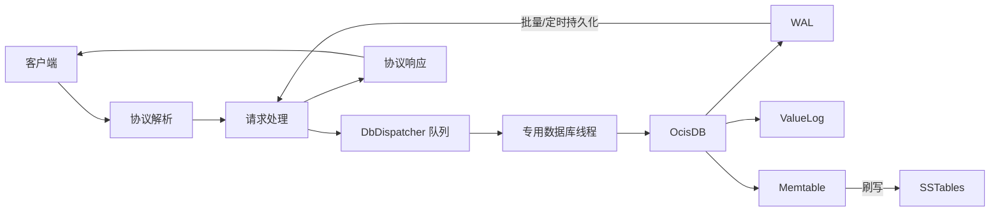

# Ocis

**中文** | [English](./README.md)

[](https://github.com/muqiuhan/Ocis/actions/workflows/build-test.yaml) [](https://github.com/muqiuhan/Ocis/actions/workflows/nightly-full-tests.yaml) [](https://github.com/muqiuhan/Ocis/actions/workflows/nightly-release.yaml)

Ocis 是一个基于 F# 和 .NET 10 实现的键值存储引擎。它提供两种运行形态：嵌入式存储引擎（Ocis）和 TCP 服务器。嵌入式形态允许开发者将存储引擎直接集成至应用程序进程；服务器形态则通过自定义二进制协议暴露 SET/GET/DELETE 操作。

Ocis 定位于单节点场景。它不提供分布式复制、Raft 共识或故障转移机制。如果系统架构需要跨节点数据一致性，应考虑其他方案。

## 架构

Ocis 采用 WiscKey 风格的键值分离存储设计。WiscKey 是一种 LSM-Tree 架构的变体，由 Lu 等人在 2017 年的论文 [WiscKey: Separating Keys from Values in SSD-conscious Storage](https://www.usenix.org/system/files/conference/fast16/fast16-papers-lu.pdf) 中提出。其核心思想是将键与值分离存储：键的元数据存放于 LSM-Tree，值存放于追加写日志（ValueLog）。这种设计减少了写入放大与空间放大。

Ocis 遵循这一思路。键的元数据存储于 Memtable 与 SSTable，值数据写入追加式 ValueLog。在大值场景下，传统 LSM-Tree 需要在压缩时反复读写完整键值对，而键值分离后，压缩仅处理元数据，可显著减少写放大。WAL（预写日志）负责保证写入的持久性，并支持崩溃后的重放恢复。



引擎核心采用严格的单线程线程亲和性模型。所有对 Memtable、WAL、ValueLog 的操作均在同一线程执行，线程检查失败时立即抛出异常。这种设计消除了内部锁竞争，简化了状态管理的复杂度。TCP 服务器层通过有界队列接收请求，由专用调度线程串行化执行，从而实现并发请求到单线程引擎的桥接。

技术栈选用 `Microsoft.Extensions.Hosting` 作为托管框架，`Microsoft.Extensions.Logging` 处理日志输出，`FSharp.SystemCommandLine` 构建 CLI 接口。

## 耐久性模式

Ocis 提供三种耐久性模式，对应不同的性能与持久性权衡。

Strict 模式要求每次写入操作等待 WAL 持久化刷写完成后才返回成功。这保证了最高的持久性，但每次写入都阻塞于磁盘 I/O。

Fast 模式不等待每请求的持久化确认。写入操作提交后立即返回，持久化由后台异步完成。这提供最高吞吐量，但在崩溃时可能丢失最近一批写入。

Balanced 模式采用组提交策略。请求到达后进入等待队列，当队列达到批量阈值或时间窗口超时，统一触发一次 WAL 刷写并批量唤醒所有等待者。组提交的核心优势在于将多次磁盘 I/O 合并为一次。该优势仅在并发场景下成立：单线程环境下，每个请求都独自等待窗口超时，反而比 Strict 模式更慢。测试数据表明，32 并发写入时，Balanced 模式的吞吐量是 Strict 的 7.6 倍，p99 延迟降低 79%。

| 模式     | 吞吐量优先级 | 持久性优先级 | 适用场景           |
|----------|--------------|--------------|--------------------|
| Fast     | 最高         | 最低         | 缓存、可重建数据   |
| Strict   | 最低         | 最高         | 金融、审计日志     |
| Balanced | 中等         | 中等         | 多线程通用服务器   |

单线程嵌入式场景应选择 Fast 或 Strict，不应使用 Balanced。

## 性能数据

以下数据来自本地开发环境的吞吐量测试。测试条件：value=256B，单节点，聚合结果位于 `BenchmarkDotNet.Artifacts/results/throughput/`。这些数据用于追踪仓库内的性能基线，不构成跨硬件的比较基准。

### 引擎吞吐量（单线程）

| 模式     | SET ops/s | GET ops/s |
|----------|----------:|----------:|
| Fast     |  86,814   | -         |
| Strict   |   2,140   | -         |
| Balanced |     624   |  778,993  |

Balanced 模式在单线程 SET 场景下的性能低于 Strict。原因是组提交的时间窗口在无并发时成为额外延迟源。

### 服务器吞吐量（32 并发，SET）

| 模式     | ops/s   | p99 (ms) |
|----------|--------:|---------:|
| Fast     | 35,196  | 21       |
| Balanced |  3,109  | 20       |
| Strict   |    410  | 94       |

多线程服务器场景下，Balanced 相比 Strict 吞吐量提升约 7.6 倍，p99 延迟从 94ms 降至 20ms。

## 快速开始

```bash
dotnet build Ocis.sln -c Release
```

运行服务器前需创建数据目录：

```bash
mkdir -p ./data
dotnet run --project Ocis.Server/Ocis.Server.fsproj -- ./data \
  --host 0.0.0.0 \
  --port 7379 \
  --durability-mode Balanced \
  --log-level Info
```

完整参数说明参见 `Ocis.Server --help`。

测试执行：

```bash
dotnet test Ocis.Tests/Ocis.Tests.fsproj --filter "TestCategory!=Slow"
dotnet test Ocis.Server.Tests/Ocis.Server.Tests.fsproj
```

## 部署

生产环境部署前需完成以下准备：

- 配置 TLS 终止与认证（建议通过反向代理或网关实现）
- 建立监控以追踪请求延迟、错误率、调度器队列深度及 WAL 增长
- 执行崩溃恢复测试与吞吐量验证

相关运维文档：`docs/operations/production-runbook.md`、`docs/operations/release-checklist.md`、`docs/operations/rollback-playbook.md`。

## 项目结构

```
Ocis/
├── Ocis/                 # 核心存储引擎
├── Ocis.Server/          # TCP 服务器
├── Ocis.Tests/           # 引擎测试
├── Ocis.Server.Tests/    # 服务器测试
├── Ocis.Perf/            # 性能测试工具
└── Ocis.Perf.Tests/      # 性能测试验证
```

## [许可证](./LICENSE)

```
Copyright (c) 2025 ~ 2026 Somhairle H. Marisol

All rights reserved.

Redistribution and use in source and binary forms, with or without modification,
are permitted provided that the following conditions are met:

    * Redistributions of source code must retain the above copyright notice,
      this list of conditions and the following disclaimer.
    * Redistributions in binary form must reproduce the above copyright notice,
      this list of conditions and the following disclaimer in the documentation
      and/or other materials provided with the distribution.
    * Neither the name of Ocis nor the names of its contributors
      may be used to endorse or promote products derived from this software
      without specific prior written permission.

THIS SOFTWARE IS PROVIDED BY THE COPYRIGHT HOLDERS AND CONTRIBUTORS
"AS IS" AND ANY EXPRESS OR IMPLIED WARRANTIES, INCLUDING, BUT NOT
LIMITED TO, THE IMPLIED WARRANTIES OF MERCHANTABILITY AND FITNESS FOR
A PARTICULAR PURPOSE ARE DISCLAIMED. IN NO EVENT SHALL THE COPYRIGHT OWNER OR
CONTRIBUTORS BE LIABLE FOR ANY DIRECT, INDIRECT, INCIDENTAL, SPECIAL,
EXEMPLARY, OR CONSEQUENTIAL DAMAGES (INCLUDING, BUT NOT LIMITED TO,
PROCUREMENT OF SUBSTITUTE GOODS OR SERVICES; LOSS OF USE, DATA, OR
PROFITS; OR BUSINESS INTERRUPTION) HOWEVER CAUSED AND ON ANY THEORY OF
LIABILITY, WHETHER IN CONTRACT, STRICT LIABILITY, OR TORT (INCLUDING
NEGLIGENCE OR OTHERWISE) ARISING IN ANY WAY OUT OF THE USE OF THIS
SOFTWARE, EVEN IF ADVISED OF THE POSSIBILITY OF SUCH DAMAGE.
```