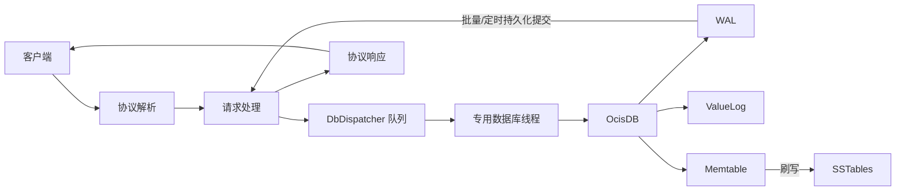

# Ocis

**中文** | [English](./README.md)

[](https://github.com/muqiuhan/Ocis/actions/workflows/build-test.yaml)
[](https://github.com/muqiuhan/Ocis/actions/workflows/qodana_code_quality.yml)

Ocis 是一个使用 F# 实现的键值存储项目，提供两种运行形式：

- **Ocis**：嵌入式存储引擎，采用 WiscKey 风格的键值分离设计
- **Ocis.Server**：TCP 服务器，通过自定义二进制协议提供 `SET/GET/DELETE` 操作

## 项目概述

### Ocis 的特点
- 适合单节点部署，需要轻量级嵌入式引擎和 TCP 服务器
- 包含多种耐久性模式（`Strict`、`Balanced`、`Fast`）、WAL 重放、SSTable 压缩和恢复测试

### Ocis 的局限性
- 不是分布式/复制数据库（不支持 Raft、多节点一致性、内置故障转移）

## 项目结构

```
Ocis/
├── Ocis/                      # 核心存储引擎
│   ├── Ocis.fs               # 主引擎实现
│   └── Ocis.fsproj           # 项目文件
├── Ocis.Server/              # TCP 服务器
│   ├── Program.fs            # CLI 入口点
│   ├── Config.fs             # 配置验证
│   ├── Host.fs               # 托管服务
│   ├── Server.fs             # TCP 服务器
│   ├── DbDispatcher.fs       # 数据库调度器
│   └── Ocis.Server.fsproj    # 项目文件
├── Ocis.Tests/               # 引擎测试
├── Ocis.Server.Tests/        # 服务器测试
├── Ocis.Perf/                # 性能测试工具
└── Ocis.Perf.Tests/          # 性能测试验证
```

## 架构与技术栈

### 技术栈
- **语言/运行时**：F# + .NET 10
- **托管框架**：`Microsoft.Extensions.Hosting`
- **日志框架**：`Microsoft.Extensions.Logging`
- **CLI 框架**：`FSharp.SystemCommandLine`

### 并发模型
- **引擎**：严格的单线程线程亲和性，错误线程会快速失败
- **服务器**：有界队列 + 专用调度线程，异步处理请求

### 存储设计
- **键元数据**：存储在 Memtable/SSTable 中
- **值数据**：存储在追加写入的 ValueLog 中
- **持久性**：使用 WAL（预写日志）保证持久性和重放

## 请求/数据流



## 耐久性模式

- **Strict**：每次写入都等待 WAL 持久化刷写后才返回成功（最高耐久性）
- **Balanced**：组提交（时间窗口 + 批量大小触发）- 适用于多线程服务器
- **Fast**：不等待每请求的持久化刷写（吞吐量最高，耐久性最弱）

### 各模式适用场景

| 场景 | 推荐模式 | 原因 |
| ---- | -------- | ---- |
| 单线程引擎（嵌入式） | **Fast** 或 **Strict** | Balanced 在单线程下无优势 |
| 多线程服务器 | **Balanced** | 组提交比 Strict 提升 7.6 倍吞吐量 |

**注意**：Balanced 模式的组提交优势仅在并发多线程工作负载下显现。在单线程场景下，时间窗口触发过于频繁，Balanced 实际表现比 Strict 差。

## 实现要点

- 引擎核心操作通过线程亲和性检查强制执行严格的单线程模型
- 服务器调度器将引擎绑定到专用工作线程
- Balanced 耐久性模式通过延迟提交等待优化，避免调度器队头阻塞
- WAL 检查点/重置功能已实现并有测试覆盖

## 性能测试结果

测试环境：本地开发机，单节点，`value=256B`，从 `Ocis.Perf` 进行短时间重复运行，聚合结果位于 `BenchmarkDotNet.Artifacts/results/throughput/`。

### 引擎（workers=1）

| 模式     | 工作负载 | 吞吐量 (ops/s) | p99 (ms) |
| -------- | -------- | -------------: | -------: |
| Fast     | set      |      86,813.97 |      0.01 |
| Strict   | set      |       2,140.32 |      0.64 |
| Balanced | set      |         624.21 |      1.98 |
| Balanced | get      |     778,993.12 |     ~0.01 |

**注意**：在单线程引擎中，Balanced 模式（优化后的 1ms 窗口）实际上比 Strict 慢。这是因为组提交仅在并发多线程工作负载下才有帮助。

### 服务器（workers=32, set）

| 模式     |     ops/s | p99 (ms) |
| -------- | --------: | -------: |
| Fast     | 35,196.24 |    21.07 |
| Balanced |  3,109.27 |    19.79 |
| Strict   |    410.06 |    94.04 |

**分析：**
- Balanced 比 Strict 提供 **7.6 倍** 吞吐量提升（3,109 vs 410 ops/s）
- Balanced 比 Strict 提供 **4.8 倍** 更低的 p99 延迟（19.79 vs 94.04 ms）
- 组提交在并发多线程工作负载下表现出色

**说明：**
- 这些不是跨机器基准测试声明，请将其视为当前仓库的基线快照
- 默认组提交参数：`--group-commit-window-ms 1 --group-commit-batch-size 10`

## 构建、运行、测试

### 构建

```bash
dotnet build Ocis.sln -c Release
```

### 运行服务器

`working-dir` 是必需的位置参数。**注意：** 目录必须在运行前创建。

```bash
# 首先创建数据目录
mkdir -p ./data

# 运行服务器
dotnet run --project Ocis.Server/Ocis.Server.fsproj -- ./data \
  --host 0.0.0.0 \
  --port 7379 \
  --max-connections 1000 \
  --flush-threshold 1000 \
  --durability-mode Balanced \
  --group-commit-window-ms 1 \
  --group-commit-batch-size 10 \
  --db-queue-capacity 8192 \
  --checkpoint-min-interval-ms 30000 \
  --log-level Info
```

### 运行测试

```bash
# 引擎 + 服务器测试
dotnet test Ocis.Tests/Ocis.Tests.fsproj --filter "TestCategory!=Slow"
dotnet test Ocis.Server.Tests/Ocis.Server.Tests.fsproj

# 性能测试工具验证
dotnet test Ocis.Perf.Tests/Ocis.Perf.Tests.fsproj
```

## 性能测试与部署

### 吞吐量基准测试命令

```bash
# 引擎矩阵（严格单线程基线）
bash scripts/run-throughput-engine.sh

# 服务器矩阵
bash scripts/run-throughput-server.sh 127.0.0.1 7379
```

详见 `docs/operations/performance-testing.md`，了解预热、重复、聚合格式和解释。

### 部署建议

**适用场景：**
- 单节点服务部署，可明确选择耐久性模式

**生产环境暴露前建议：**
- 在前置层添加 TLS 和认证（反向代理/网关）
- 监控关键指标：请求延迟、错误率、调度器队列深度、WAL 增长
- 发布前运行崩溃恢复和吞吐量检查

**相关文档：**
- `docs/operations/production-runbook.md`
- `docs/operations/release-checklist.md`
- `docs/operations/rollback-playbook.md`

## 许可证

详见 [LICENSE](./LICENSE)。
